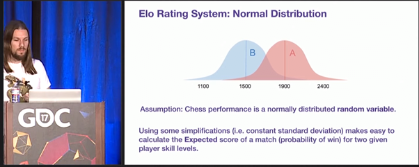
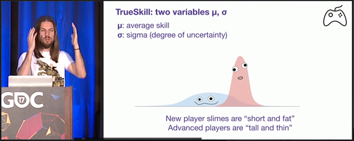

# Trueskill Algorithm. 

Trueskill algorithm additionally consider the standard deviation of each player(or team)'s performance. 

For example, 

This is the example of classical rating algorithms image. They don't consider about their dev of performances.

And this is the image of what trueskill algorithm calculate. 

As considering the dev of performances of each team, that algorithm can calculate each team's expected winning rate more precisely.

I exampled two teams, which have elo rating 800 and 1000, and the expected rate for the weaker was 24%. However if the two teams have huge deviations, the weaker's rate became bigger.

### Basic Formulas of Trueskill Algorithmes(for the simplest case; 1:1)

$$\mu_{winner} = \mu_{winner, prior} + \frac{\sigma^2}c\cdot v(\frac{(\mu_{winner, prior}-\mu_{loser, prior})}c\cdot\frac{\epsilon}c)$$

$$\mu_{loser} = \mu_{loser, prior} - \frac{\sigma^2}{c} \cdot v\left( \frac{\mu_{winner, prior} - \mu_{loser, prior}}{c} \cdot \frac{\epsilon}{c} \right)$$

$$\sigma^2_{winner} = \sigma^2_{winner, prior} \cdot \left[ 1 - \frac{\sigma^2_{winner, prior}}{c^2} \cdot w \left( \frac{\mu_{winner, prior} - \mu_{loser, prior}}{c} \cdot \frac{\epsilon}{c} \right) \right]$$

$$\sigma^2_{\text{loser}} = \sigma^2_{\text{loser, prior}} \cdot \left[ 1 - \frac{\sigma^2_{\text{loser, prior}}}{c^2} \cdot w \left( \frac{\mu_{\text{winner, prior}} - \mu_{\text{loser, prior}}}{c} \cdot \frac{\epsilon}{c} \right) \right]$$

$$ c^2 = 2\beta^2 + \sigma^2_{winner} + \sigma^2_{loser}$$

Basically, this algorithm shares same premise with ELO system. The Strongers bets a lot, and the weaker does not. 

However, there is additional parametre, stdev of performance. If some team, or player has a big stdev, their rating(in this case, the mean) changes dramatically compared to the team who doesnt have.

And finally, trueskill algorithm has a target that make uncertainty small, thus estimate the true skill(mean).

And someone can assume this question then. "So every players' stdev in this algorithm goes to zero?"

The answer is NO. The analyser or rater use other parametres like beta and tau, to adjust uncertainty.

Some of workers in RIOT GAMING says that they have planned to use this algorithm as new rating system. Expecially for returned user or new-bies. 

These kind of users have huge uncertainty than other users who plays for 10+ seasons, so the company give them huge stdevs and that they can goes to their skill level place easier and faster.

For now we can not sure that they actually use this algorithm. But we might has to consider it seriously if we want to analyse about their rating-matching system I suppose.